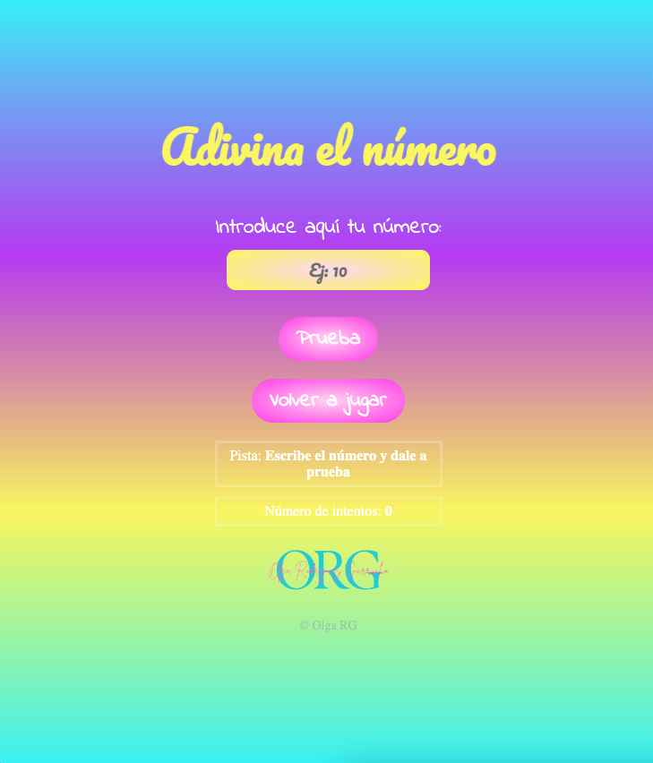
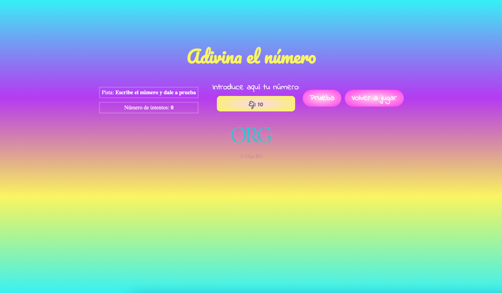

# Intermediate exercise Olga RG

---

Module 2 - Intermediate evaluation - Olga Rodríguez Garrucho

---

---

## Table of Contents

1. [General-Info] (#general-info)
2. [Technologies] (#technologies)
3. [Result] (#result)

---

## General Info

Exercise of module 2´s intermediate evaluation by Olga Rodríguez Garrucho. Creat a web with the game "Adivinar el número". Use of HTML, CSS and JavaScripts.

---

### Game:

---

## Technologies

- [Visual-Studio-Node] (https://code.visualstudio.com/download) Version: May 2022
- [Git] (https://git-scm.com/download/mac) Version: 2.36.1
- [JavaScripts] (https://www.javascript.com/)
- [Git-Hub] (https://github.com/)

---

## Result

To view the final´s result of exercise click on GitHub Pages of https://github.com/Adalab/modulo-2-evaluacion-intermedia-olguita2412/tree/main repository.
